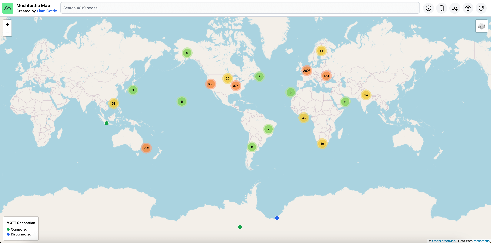

<h2 align="center">Meshtastic Map</h2>

<p align="center">
<a href="https://discord.gg/K55zeZyHKK"></a>
<a href="https://twitter.com/liamcottle"></a>
<br/>
<a href="https://ko-fi.com/liamcottle"></a>
<a href="./donate.md"></a>
</p>

A map of all Meshtastic nodes heard via MQTT.

My version of the map is available at https://meshtastic.liamcottle.net



## How does it work?

- An [mqtt client](./src/mqtt.js) is persistently connected to `mqtt.meshtastic.org` and subscribed to the `#` topic.
- All messages received are attempted to be decoded as [ServiceEnvelope](https://buf.build/meshtastic/protobufs/docs/main:meshtastic#meshtastic.ServiceEnvelope) packets.
- If a packet is encrypted, it attempts to decrypt it with the default `AQ==` key.
- If a packet can't be decoded as a `ServiceEnvelope`, it is ignored.
- `NODEINFO_APP` packets add a node to the database.
- `POSITION_APP` packets update the position of a node in the database.
- `NEIGHBORINFO_APP` packets log neighbours heard by a node to the database.
- `TELEMETRY_APP` packets update battery and voltage metrics for a node in the database.
- `TRACEROUTE_APP` packets log all trace routes performed by a node to the database.
- `MAP_REPORT_APP` packets are stored in the database, but are not widely adopted, so are not used yet.
- The database is a MySQL server, and a nodejs express server is running an API to serve data to the map interface.

## Features

- [x] Connects to mqtt.meshtastic.org to collect nodes and metrics.
- [x] Shows nodes on the map if they have reported a valid position.
- [x] Search bar to find nodes by ID, Hex ID, Short Name and Long Name.
- [x] Hover over nodes on the map to see basic information and a preview image.
- [x] Click nodes on the map to show a sidebar with more info such as telemetry graphs and traceroutes.
- [x] Ability to share a direct link to a node. The map will auto navigate to it.
- [x] Device list. To see which hardware models are most popular.
- [x] Mobile optimised layout.
- [x] Settings available to hide nodes from the map if they haven't been updated in a while.
- [x] "Neighbours" map layer. Shows blue connection lines between nodes that heard the other node.
  - This information is taken from the `NEIGHBORINFO_APP`.
  - Some neighbour lines are clearly wrong.
  - Meshtastic firmware older than [v2.3.2](https://github.com/meshtastic/firmware/releases/tag/v2.3.2.63df972) reports MQTT nodes as Neighbours.
  - This was fixed in [meshtastic/firmware/#3457](https://github.com/meshtastic/firmware/pull/3457), but adoption will likely be slow...

## Planned Features

- Login/Register to manually add nodes to the map, and manage their details.
- Collect all `ServiceEnvelope` packets and provide a UI to filter and view them.
- Real-Time message UI to view `TEXT_MESSAGE_APP` packets as they come in.
- Map Filters
  - Filter out "Neighbours" based on max distance setting. Eg no greater than 200km.
  - Filter by Hardware Model
  - Filter by Frequency (we don't have this information yet)
  - Filter by Last Updated (ie, only show nodes heard in the last 1hr, 24hr, etc)

## Ideas

- Maybe a way to "claim" nodes, by sending a custom message from the node.
  - Set other information, such as frequency, antenna info.
  - Could allow you to upload your own photos of the node to show on the map.

## TODO

- dedupe packets to prevent spamming database
- track gateway id and channel for packets

- show frequency
- welcome modal
- not affiliated with meshtastic info
- donate link
- login/register to add nodes to the map manually
  - need to prevent spam
  - captcha for reg
  - limit how many nodes can be added from an account

- ui to view realtime events from specific nodes
- ui to view text messages log
- store x days worth of historical logs
- be able to go back in time and see how the mesh evolved

## Install

Clone the project repo.

```
git clone https://github.com/liamcottle/meshtastic-map
cd meshtastic-map
```

Install NodeJS dependencies

```
npm install
```

Create a `.env` environment file.

```
touch .env
```

Add a database [connection string for prisma](https://www.prisma.io/docs/getting-started/setup-prisma/add-to-existing-project/relational-databases/connect-your-database-typescript-postgresql) to `.env` file.

```
DATABASE_URL="mysql://root@localhost:3306/meshtastic-map?connection_limit=100"
```

Migrate the database.

```
npx prisma migrate dev
```

Run the MQTT listener, to save packets to database.

```
node src/mqtt.js
```

Run the Express Server, to serve the `/api` and Map UI.

```
node src/index.js
# Server running at http://127.0.0.1:8080
```

## Upgrading

Run the following commands from inside the `meshtastic-map` repo.

```
# update repo
git fetch && git pull

# migrate database
npx prisma migrate dev
```

You will now need to restart the `index.js` and `mqtt.js` scripts.

## MQTT Collector

By default, the [MQTT Collector](./src/mqtt.js) connects to the public Meshtastic MQTT server.
Alternatively, you may provide the relevant options shown in the help section below to connect to your own MQTT server along with your own decryption keys.

```
node src/mqtt.js --help
```

```
Meshtastic MQTT Collector

  Collects and processes service envelopes from a Meshtastic MQTT server. 

Options

  -h, --help                                    Display this usage guide.
  --mqtt-broker-url string                      MQTT Broker URL (e.g: mqtt://mqtt.meshtastic.org)
  --mqtt-username string                        MQTT Username (e.g: meshdev)
  --mqtt-password string                        MQTT Password (e.g: large4cats)
  --collect-service-envelopes                   This option will save all received service envelopes to the database.
  --decryption-keys <base64DecryptionKey> ...   Decryption keys encoded in base64 to use when decrypting service envelopes.
  --purge-interval-seconds number               How long to wait between each automatic database purge.
  --purge-nodes-unheard-for-seconds number      Nodes that haven't been heard from in this many seconds will be purged from the database.
```

To connect to your own MQTT server, you could do something like the following;

```
node src/mqtt.js --mqtt-broker-url mqtt://mqtt.example.com --mqtt-username username --mqtt-password password --decryption-keys 1PG7OiApB1nwvP+rz05pAQ==
```

## Contributing

If you have a feature request, or find a bug, please [open an issue](https://github.com/liamcottle/meshtastic-map/issues) here on GitHub.

## License

MIT

## Legal

This project is not affiliated with or endorsed by the Meshtastic project.

The Meshtastic logo trademark is the trademark of Meshtastic LLC.

## References

- https://meshtastic.org/docs/software/integrations/mqtt/
- https://buf.build/meshtastic/protobufs/docs/main:meshtastic
